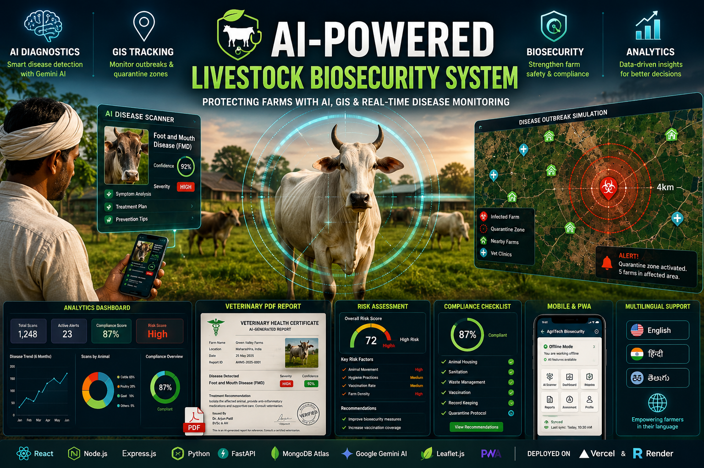
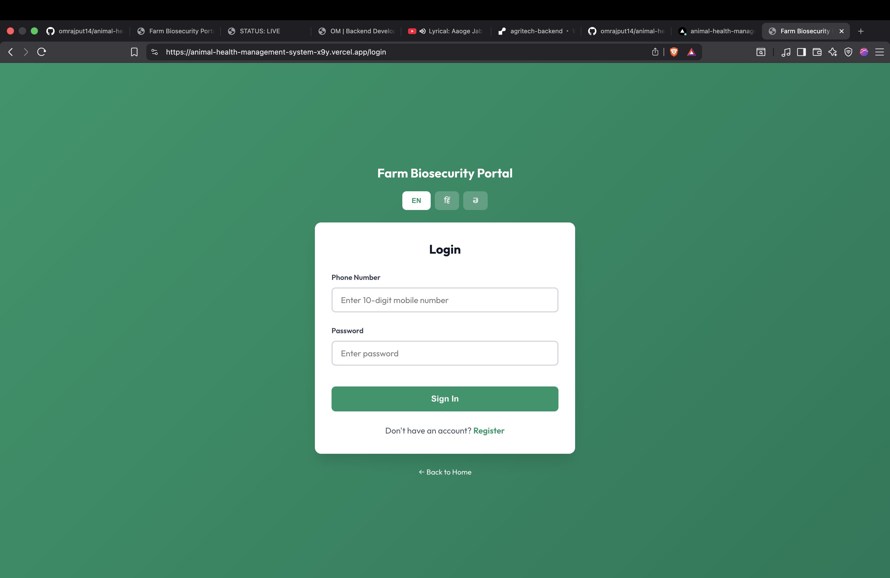
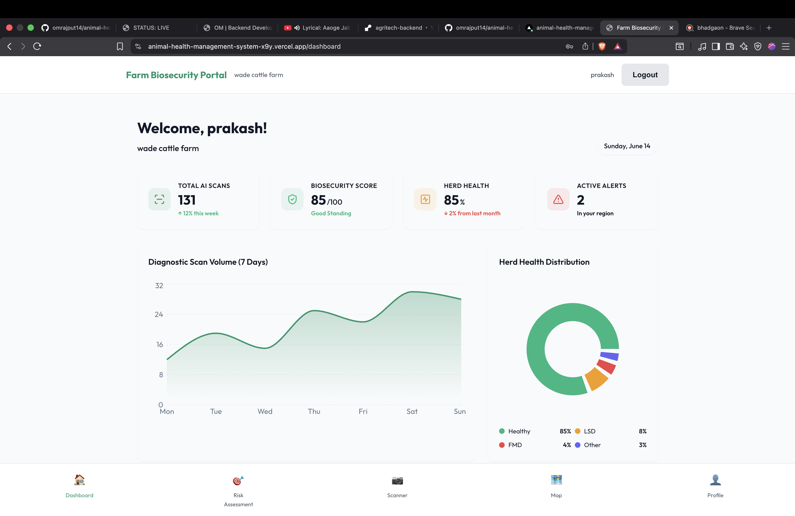
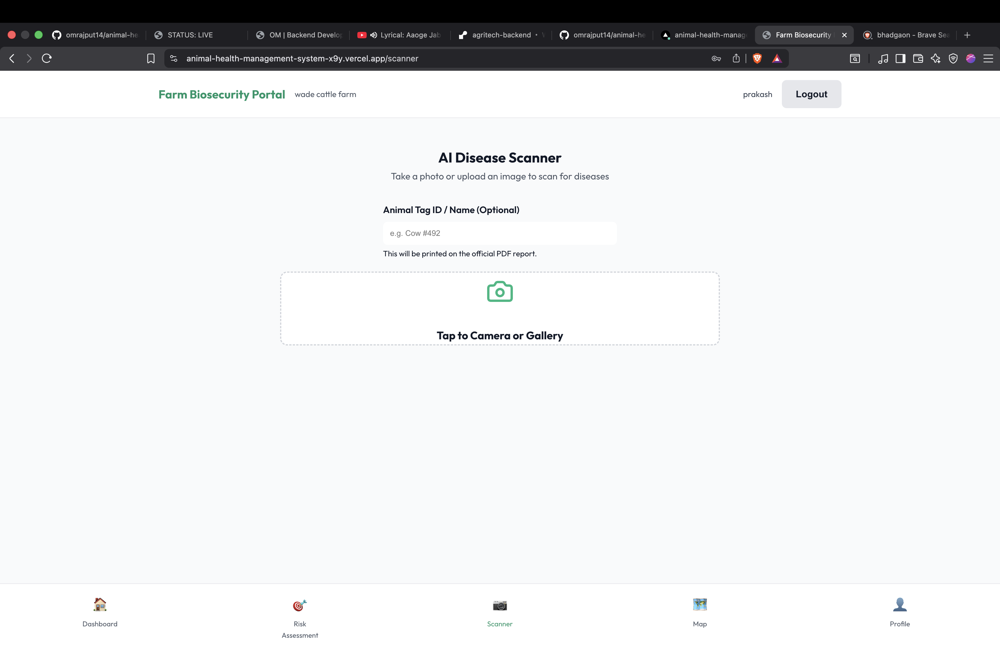
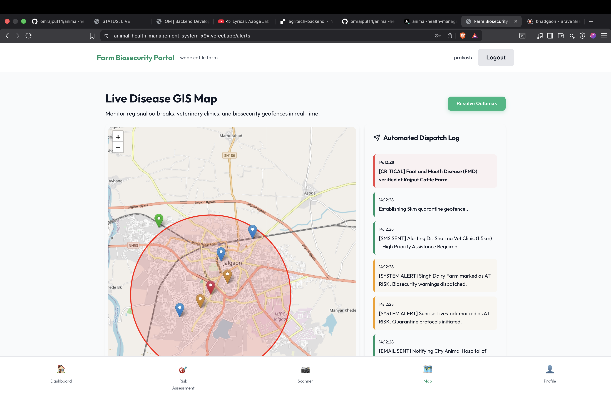
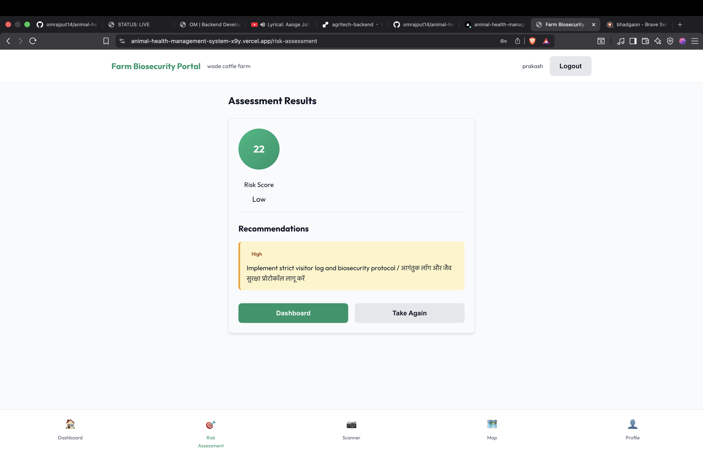
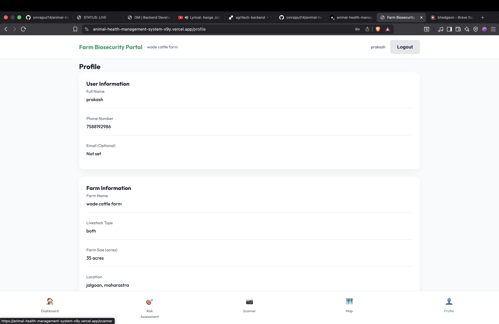

<div align="center">



<br />


# 🐄 AgriTech Biosecurity System

### _"Because every animal deserves a doctor, and every farmer deserves AI."_

<br />

[](https://reactjs.org/)
[](https://nodejs.org/)
[](https://fastapi.tiangolo.com/)
[](https://deepmind.google/technologies/gemini/)
[](https://www.mongodb.com/atlas)
[](https://web.dev/progressive-web-apps/)
[](https://vercel.com/)
[](https://render.com/)

<br />

**An enterprise-grade, AI-powered Progressive Web App for livestock disease diagnostics,**  
**farm biosecurity management, and real-time outbreak containment.**

Built from scratch with a microservice architecture spanning **3 independent servers**,  
deployed live across **2 cloud platforms**, and powered by **Google's Gemini Vision AI**.

[🚀 Live Demo](https://animal-health-management-system-x9y.vercel.app) · [Screenshots](#-app-showcase) · [Features](#-what-it-does) · [Tech Stack](#-architecture--tech-stack)

</div>

---

## 📸 App Showcase

<div align="center">

### 🔐 Login & Authentication


<br /><br />

### 📊 Analytics Dashboard


<br /><br />

### 🧠 AI Disease Scanner


<br /><br />

### 🗺️ GIS Map & Outbreak Simulation


<br /><br />

### 📝 Risk Assessment Results


<br /><br />

### 👤 Farm Profile


<br /><br />

### 📄 Sample AI-Generated Veterinary Report
> 🔗 [Download Sample Vet Report (PDF)](screenshots/sample-vet-report.pdf)

</div>

---

## 🧬 The Problem

> In rural India, **60% of livestock diseases go undiagnosed** until it's too late.  
> Farmers lack access to veterinary experts. By the time they travel to a clinic, diseases have already spread to neighboring farms.  
> There is no centralized system to track outbreaks, issue quarantine alerts, or generate legally valid health certificates on-the-fly.

**This project solves all three.**

---

## 📊 System Infographic

<div align="center">


</div>

---

## 🎬 What It Does

### 🧠 1. AI Disease Scanner — _Powered by Google Gemini 2.5 Flash_

Upload or snap a photo of any livestock animal. The image is sent through the Node.js backend gateway to a dedicated **Python FastAPI microservice**, which forwards it to **Google's Gemini Vision AI** with a custom veterinary pathology prompt.

The AI returns:
- 🏷️ **Disease Name** (common + scientific)
- 📊 **Confidence Score** (0–100%)
- 🔴 **Severity Level** (Critical / High / Medium / Low / None)
- 📋 **Visual Symptom Analysis** — what the AI actually detected in the pixels
- 💊 **Treatment Plan** — immediate veterinary action steps
- 🐄 **Animal Category** — Cattle, Poultry, Pig, etc.

> _This isn't a toy demo with hardcoded responses — it's a real AI analyzing real images._

---

### 📄 2. Premium Veterinary PDF Reports — _Client-Side Generation_

After the AI diagnosis, the user can generate a **professional, A4-ready Veterinary Health Certificate** directly in the browser using `html2pdf.js` — no server round-trip needed. The PDF includes the uploaded photograph, full diagnostic results, treatment recommendations, and a unique report ID for traceability.

---

### 🗺️ 3. Live GIS Disease Tracking Map — _Leaflet.js Geofencing_

An interactive geographic map that visualizes your farm, nearby veterinary clinics, and neighboring farms. The **Outbreak Simulation Engine** lets you trigger a simulated outbreak, watch a **4km quarantine circle** expand, and see which farms fall within the danger zone — complete with auto-generated dispatch notifications.

---

### 📊 4. Real-Time Analytics Dashboard

A data-rich dashboard built with `Recharts` featuring line charts, pie charts, live stats cards, and a biosecurity compliance score — all with smooth animated transitions.

---

### 🛡️ 5. Biosecurity Compliance Engine

Checklist-based auditing across multiple biosecurity categories with a weighted scoring algorithm, historical tracking, and automatic risk flagging.

---

### 📝 6. Interactive Risk Assessment

A guided, multi-step questionnaire covering animal housing, feed sources, visitor protocols, vaccination schedules, and waste management — calculates a **dynamic risk score** (Low → Critical) with specific improvement recommendations.

---

### 📱 7. Progressive Web App — _Works Offline_

This isn't just a website. It's an **installable application** with a custom Workbox service worker, real-time offline detection, smart UI degradation, and full `manifest.json` configuration. Designed for rural India where internet connectivity drops frequently.

---

### 🌐 8. Multilingual Support

Full internationalization in **English**, **Hindi (हिन्दी)**, and **Telugu (తెలుగు)** via `i18next`.

---

### 🔐 9. Authentication & Security

JWT-based authentication, bcrypt password hashing, role-based access control, CORS-configured backend, and middleware-protected routes on both frontend and backend.

---

## 🏗️ Architecture & Tech Stack

```
┌─────────────────────────────────────────────────────────────┐
│                        FRONTEND                             │
│              React 18 + Redux Toolkit + PWA                 │
│                   Deployed on Vercel                        │
│                                                             │
│  ┌──────────┐ ┌──────────┐ ┌──────────┐ ┌──────────────┐   │
│  │Dashboard │ │AI Scanner│ │ GIS Map  │ │ Compliance   │   │
│  │(Recharts)│ │(Camera)  │ │(Leaflet) │ │ (Checklist)  │   │
│  └──────────┘ └──────────┘ └──────────┘ └──────────────┘   │
│  ┌──────────┐ ┌──────────┐ ┌──────────┐ ┌──────────────┐   │
│  │PDF Report│ │  Risk    │ │  Auth    │ │   Profile    │   │
│  │(html2pdf)│ │Assessment│ │(JWT+Form)│ │  (Settings)  │   │
│  └──────────┘ └──────────┘ └──────────┘ └──────────────┘   │
└────────────────────────┬────────────────────────────────────┘
                         │ HTTPS (REST API)
                         ▼
┌─────────────────────────────────────────────────────────────┐
│                    BACKEND SERVER                            │
│             Node.js + Express + Mongoose                     │
│                  Deployed on Render                          │
│                                                             │
│  ┌────────────┐ ┌────────────┐ ┌────────────────────────┐   │
│  │ Auth API   │ │ Farm API   │ │ Scanner Proxy Gateway  │   │
│  │ (bcrypt)   │ │ (CRUD)     │ │ (Forwards to Python)   │   │
│  └────────────┘ └────────────┘ └───────────┬────────────┘   │
│  ┌────────────┐ ┌────────────┐             │               │
│  │Compliance  │ │Risk Assess │             │               │
│  │    API     │ │    API     │             │               │
│  └────────────┘ └────────────┘             │               │
└────────────────────────────────────────────┬────────────────┘
                         │                   │
          ┌──────────────┘                   │
          ▼                                  ▼
┌──────────────────┐            ┌─────────────────────────┐
│  MongoDB Atlas   │            │   AI MICROSERVICE        │
│  (Cloud DB)      │            │   Python FastAPI          │
│                  │            │   Deployed on Render      │
│  • Users         │            │                          │
│  • Farms         │            │   Google Gemini 2.5      │
│  • Assessments   │            │   Vision AI Analysis     │
│  • Compliance    │            │                          │
│  • Disease Alerts│            │   /analyze endpoint      │
└──────────────────┘            └─────────────────────────┘
```

### Frontend
| Technology | Purpose |
|-----------|---------|
| React 18 | UI Framework with Hooks |
| Redux Toolkit | Global state management |
| React Router v6 | Client-side routing with protected routes |
| Recharts | Interactive data visualization |
| Leaflet / react-leaflet | GIS mapping and geofencing |
| html2pdf.js | Client-side PDF certificate generation |
| Workbox | Service worker for offline caching |
| i18next | Internationalization (EN/HI/TE) |

### Backend
| Technology | Purpose |
|-----------|---------|
| Node.js + Express | RESTful API server |
| MongoDB + Mongoose | Document database with ODM |
| JSON Web Tokens | Stateless authentication |
| bcryptjs | Password hashing |
| Multer | Multipart file upload handling |

### AI Microservice
| Technology | Purpose |
|-----------|---------|
| Python + FastAPI | High-performance async web framework |
| google-genai | Google Gemini API client |
| uvicorn | ASGI server |

---

## 🌍 Live Deployment

| Service | Platform | URL |
|---------|----------|-----|
| 🖥️ **Frontend** | Vercel | [animal-health-management-system-x9y.vercel.app](https://animal-health-management-system-x9y.vercel.app) |
| ⚙️ **Backend API** | Render | `agritech-backend.onrender.com` |
| 🧠 **AI Service** | Render | `agritech-ml-service.onrender.com` |
| 🗃️ **Database** | MongoDB Atlas | Cloud-hosted cluster |

> **Note:** Free-tier Render services spin down after 15 minutes of inactivity. The first request after idle may take ~30 seconds to cold-start.

---

## 🎓 What I Learned Building This

- **Microservice Architecture** — Designing inter-service communication between Node.js and Python through a proxy gateway pattern
- **AI Integration** — Crafting effective prompts for Gemini Vision and parsing structured JSON responses from LLMs
- **Progressive Web Apps** — Service worker lifecycle, caching strategies, and graceful offline degradation
- **GIS & Geospatial** — Working with Leaflet.js for interactive mapping, geofencing circles, and proximity calculations
- **Client-Side PDF** — Generating rich, styled documents with embedded images using html2pdf.js
- **Cloud Deployment** — Deploying a multi-service architecture across Vercel and Render with Infrastructure-as-Code
- **Security** — JWT authentication flows, bcrypt hashing, protected routes on both client and server
- **State Management** — Complex Redux Toolkit patterns with async thunks, loading states, and optimistic updates

---

## 👨‍💻 Author

<div align="center">

**Om Rajput**

_Data Science Student · AgriTech Builder_

[](https://omrajputt369.github.io)
[](https://github.com/omrajput14)

---

⭐ **If you found this project impressive, please consider giving it a star!** ⭐

</div>
